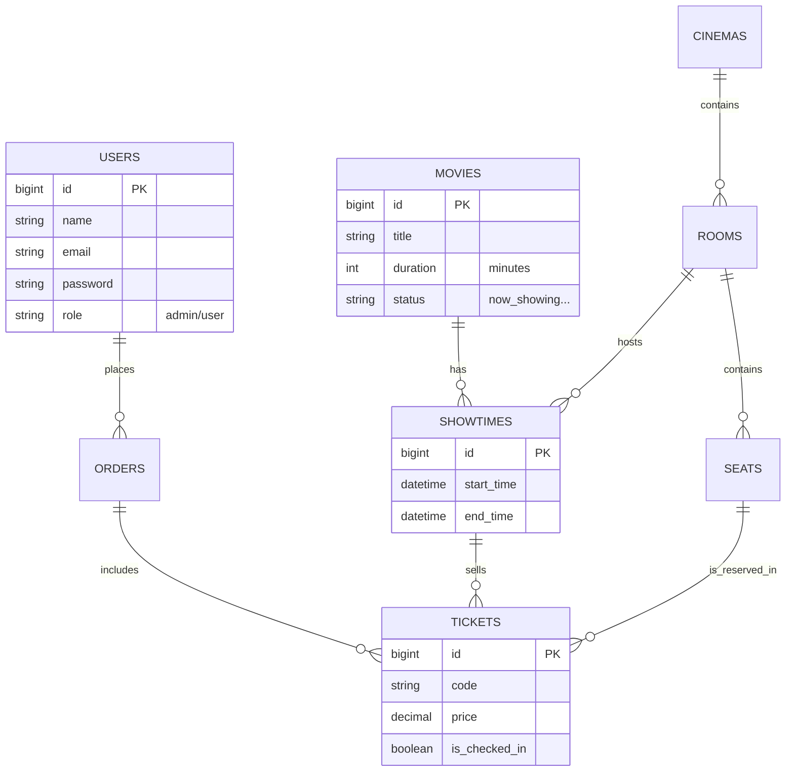

# BÁO CÁO CHI TIẾT: HỆ THỐNG QUẢN LÝ BÁN VÉ XEM PHIM (Full Documentation)

---

## MỤC LỤC
1.  **Chương 1: Tổng Quan Dự Án**
    *   1.1. Mục tiêu & Phạm vi
    *   1.2. Công nghệ sử dụng
2.  **Chương 2: Phân Tích & Thiết Kế Hệ Thống**
    *   2.1. Biểu đồ Use Case (Tổng quát & Chi tiết)
    *   2.2. Biểu đồ Cơ sở dữ liệu (ERD)
3.  **Chương 3: Thiết Kế Cơ Sở Dữ Liệu (Thông số kỹ thuật)**
4.  **Chương 4: Hiện Thực Hóa - Module Người Dùng (User)**
5.  **Chương 5: Hiện Thực Hóa - Module Quản Trị (Admin)**
6.  **Chương 6: Phân Tích Logic Nghiệp Vụ Cốt Lõi (Core Business Logic)**
7.  **Kết Luận**

---

# CHƯƠNG 1: TỔNG QUAN DỰ ÁN

## 1.1. Mục tiêu & Phạm vi
Dự án xây dựng một nền tảng bán vé xem phim trực tuyến hoàn chỉnh, giúp giải quyết bài toán quản lý rạp chiếu phim và mang lại trải nghiệm đặt vé thuận tiện cho khách hàng.

**Phạm vi chức năng:**
*   **Khách hàng (User)**: Đăng ký/Đăng nhập, Tìm kiếm phim, Xem chi tiết phim, Đặt vé (chọn ghế), Thanh toán, Quản lý lịch sử vé.
*   **Quản trị viên (Admin)**: Quản lý Rạp, Phòng chiếu, Phim, Xếp lịch chiếu (Showtimes), Quản lý Đơn hàng, Thống kê vé bán ra.

## 1.2. Công nghệ sử dụng
*   **Backend**: Laravel 11 (PHP Frameowrk) - Mạnh mẽ, bảo mật, chuẩn MVC.
*   **Frontend**: Blade Templates, TailwindCSS (Giao diện hiện đại, Responsive), JavaScript (Xử lý ghế động).
*   **Database**: MySQL - Lưu trữ dữ liệu quan hệ.

---

# CHƯƠNG 2: PHÂN TÍCH & THIẾT KẾ HỆ THỐNG

## 2.1. Biểu đồ Use Case
Use Case tổng quát mô tả sự tương tác của 2 tác nhân chính:

```mermaid
usecaseDiagram
    actor "Khách Hàng (User)" as U
    actor "Quản Trị Viên (Admin)" as A

    package "Hệ Thống Bán Vé" {
        usecase "Đăng nhập / Đăng ký" as UC1
        usecase "Tìm kiếm & Xem phim" as UC2
        usecase "Đặt vé & Chọn ghế" as UC3
        usecase "Thanh toán" as UC4
        usecase "Xem lịch sử vé" as UC5
        
        usecase "Quản lý Phim (CRUD)" as UC6
        usecase "Quản lý Lịch chiếu" as UC7
        usecase "Quản lý Đơn hàng" as UC8
        usecase "Thống kê doanh thu" as UC9
    }

    U --> UC1
    U --> UC2
    U --> UC3
    U --> UC4
    U --> UC5

    A --> UC1
    A --> UC6
    A --> UC7
    A --> UC8
    A --> UC9
```

> **[HÌNH ẢNH 4: ẢNH CHỤP MÀN HÌNH TRANG CHỦ]**
> *Vị trí chèn ảnh*: Chụp trang chủ (Landing Page) hiển thị danh sách phim đang chiếu.

## 2.2. Biểu đồ Quan hệ Thực thể (ERD)
Mô tả mối quan hệ giữa các bảng trong Database.



---

# CHƯƠNG 3: THIẾT KẾ CƠ SỞ DỮ LIỆU

Chi tiết cấu trúc các bảng quan trọng nhất.

### 3.1. Bảng `showtimes` (Lịch chiếu)
Lưu trữ thông tin khi nào, ở đâu chiếu phim gì.
| Tên cột | Kiểu dữ liệu | Mô tả |
| :--- | :--- | :--- |
| `id` | BigInt (PK) | Khóa chính |
| `movie_id` | BigInt (FK) | Liên kết bảng Movies |
| `room_id` | BigInt (FK) | Liên kết bảng Rooms |
| `start_time` | DateTime | Thời gian bắt đầu chiếu |
| `end_time` | DateTime | Thời gian kết thúc (thường = start + duration + cleanup) |

### 3.2. Bảng `tickets` (Vé)
Mỗi dòng là một ghế đã bán.
| Tên cột | Kiểu dữ liệu | Mô tả |
| :--- | :--- | :--- |
| `id` | BigInt (PK) | Khóa chính |
| `order_id` | BigInt (FK) | Thuộc đơn hàng nào |
| `seat_id` | BigInt (FK) | Ghế nào |
| `showtime_id`| BigInt (FK) | Suất chiếu nào (để query nhanh) |
| `price` | Decimal | Giá vé tại thời điểm mua |
| `code` | String | Mã vé (QR Code) |
| `is_checked_in`| Boolean | Trạng thái soát vé |

---

# CHƯƠNG 4: HIỆN THỰC HÓA - MODULE USER

### 4.1. Quy Trình Xác Thực (Authentication)
Dự án sử dụng **Laravel Breeze** tùy chỉnh.
*   **Controller**: `ProfileController`
*   **Chức năng**:
    *   Cập nhật thông tin cá nhân.
    *   Đổi mật khẩu.
    *   Xem lịch sử giao dịch.

> **[HÌNH ẢNH 5: TRANG PROFILE & LỊCH SỬ VÉ]**
> *Vị trí chèn ảnh*: Chụp giao diện trang cá nhân của người dùng.

---

# CHƯƠNG 5: HIỆN THỰC HÓA - MODULE ADMIN

Module Admin được bảo vệ bởi Middleware `admin`. Nếu User thường truy cập sẽ bị chặn (403 Forbidden).

### 5.1. Quản Lý Phim & Suất Chiếu
*   **Luồng xử lý**: Admin nhập liệu -> Validation -> Service xử lý -> Lưu DB.
*   **Điểm đặc biệt**:
    *   Khi tạo suất chiếu (`ShowtimeController`), hệ thống tự động kiểm tra logic **"Trùng Lịch"** (Overlap Check): *Không thể tạo suất chiếu mới nếu phòng chiếu đó đang bận chiếu phim khác trong khoảng thời gian chọn.*

**Code kiểm tra trùng lịch (`ShowtimeService`):**
```php
public function checkOverlap($roomId, $start, $end) {
    return Showtime::where('room_id', $roomId)
        ->where(function ($query) use ($start, $end) {
            $query->whereBetween('start_time', [$start, $end])
                  ->orWhereBetween('end_time', [$start, $end]);
        })->exists();
}
```

> **[HÌNH ẢNH 6: GIAO DIỆN QUẢN LÝ SUẤT CHIẾU]**
> *Vị trí chèn ảnh*: Chụp bảng danh sách suất chiếu (Admin Panel).

---

# CHƯƠNG 6: PHÂN TÍCH LOGIC NGHIỆP VỤ CỐT LÕI (BOOKING FLOW)

Đây là "trái tim" của hệ thống. Quy trình đặt vé đảm bảo tính chính xác tuyệt đối (Concurrency Control).

### 6.1. Sơ đồ Hoạt động (Activity Diagram)

```mermaid
graph TD
    Start((Bắt đầu)) --> SelectMovie[Chọn Phim]
    SelectMovie --> SelectShowtime[Chọn Suất Chiếu]
    SelectShowtime --> ViewSeats[Xem Sơ Đồ Ghế]
    
    ViewSeats --> ClickSeat{Click Ghế}
    ClickSeat -->|Ghế Đã Bán| AlertCustomer[Báo: Đã bán]
    ClickSeat -->|Ghế Đang Chọn| AlertLocked[Báo: Đang có người giữ]
    ClickSeat -->|Ghế Trống| LockSeat[Lock Ghế (10p)]
    
    LockSeat --> Confirm[Xác Nhận Đặt]
    Confirm --> Payment[Thanh Toán]
    
    Payment --> Success{Thành Công?}
    Success -->|Yes| CreateOrder[Tạo Order & Ticket]
    CreateOrder --> ClearLock[Xóa Lock Cache]
    ClearLock --> End((Hoàn Tất))
    
    Success -->|No| ReleaseLock[Thả Lock Ghế]
    ReleaseLock --> ViewSeats
```

### 6.2. Cơ chế Khóa Ghế (Seat Locking Mechanism)
Để tránh việc 2 người cùng mua 1 ghế:
1.  **Client**: Khi click ghế, gửi AJAX Request lên Server.
2.  **Server**:
    *   Kiểm tra `tickets` table: Ghế đã bán chưa?
    *   Kiểm tra `Cache`: Ghế có đang bị khóa bởi User ID khác không?
    *   Nếu OK -> Set Cache Key `seat_lock_{showtime}_{seat}` với TTL (Time To Live) là 10 phút.

### 6.3. Xử lý Giao Dịch (Database Transaction)
Đoạn code quan trọng nhất nằm tại `BookingController@checkout`:

```php
DB::beginTransaction(); // Bắt đầu giao dịch an toàn
try {
    // 1. Tạo Đơn hàng
    $order = Order::create([...]);

    // 2. Tạo từng vé
    foreach ($seatIds as $sid) {
        Ticket::create([
            'order_id' => $order->id,
            'seat_id' => $sid,
            // ...
        ]);
    }
    
    DB::commit(); // Lưu tất cả
} catch (\Exception $e) {
    DB::rollBack(); // Lỗi -> Hủy tất cả, không lưu gì cả
}
```

> **[HÌNH ẢNH 7: QUÁ TRÌNH CHỌN GHẾ THỰC TẾ]**
> *Vị trí chèn ảnh*: Chụp giao diện chọn ghế với 3 trạng thái: ghế trống (trắng), ghế đang chọn (đỏ), ghế đã bán (xám).

---

# CHƯƠNG 7: KẾT LUẬN

Hệ thống Quản Lý Bán Vé không chỉ đáp ứng đầy đủ các yêu cầu chức năng của một rạp chiếu phim hiện đại mà còn đảm bảo các yêu cầu phi chức năng như:
*   **Tính toàn vẹn dữ liệu**: Không bao giờ bán trùng vé.
*   **Bảo mật**: Phân quyền chặt chẽ Admin/User.
*   **Trải nghiệm**: Giao diện trực quan, thao tác nhanh.

Dự án là nền tảng vững chắc để phát triển thêm các tính năng nâng cao như: Tích hợp cổng thanh toán VNPAY/Momo, Ứng dụng di động (Mobile App), hoặc Hệ thống Loyalty (Điểm thành viên).
